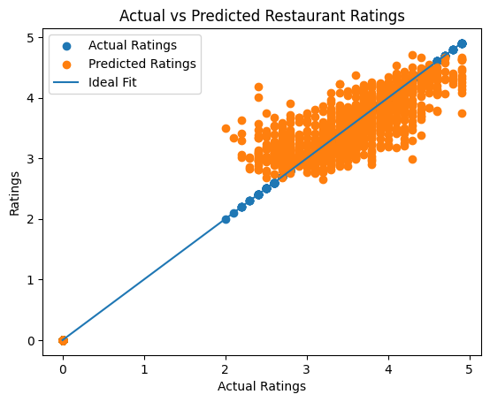
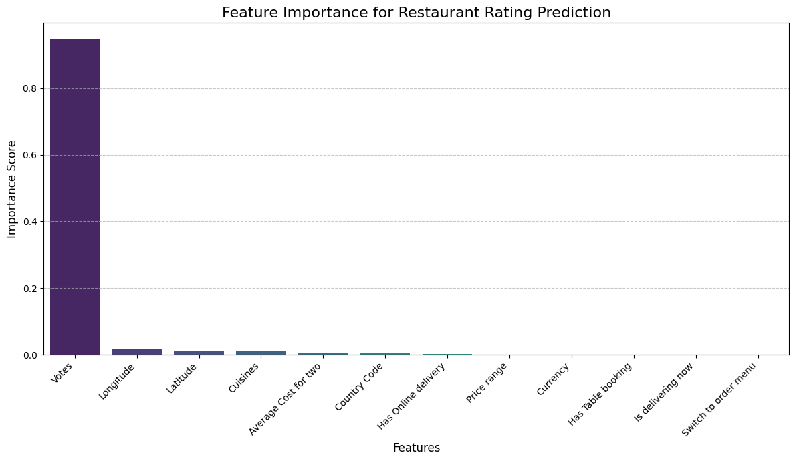

# 📘 Task 1 — Restaurant Rating Prediction
## Regression Analysis

## 🧾 1. Problem Statement

The objective of this task is to develop a machine learning regression model to predict the **aggregate rating of a restaurant** based on its features.

The problem statement specifies the following steps:

- Preprocess the dataset by handling missing values, encoding categorical variables, and splitting the data into training and testing sets.
- Select a regression algorithm and train it on the training data.
- Evaluate the model using regression metrics such as **Mean Squared Error (MSE)** and **R² score**.
- Interpret the model results and analyze the most influential features affecting restaurant ratings.

---

## 📊 2. Dataset Overview

The dataset contains various restaurant attributes such as:

- Restaurant location (City, Latitude, Longitude)
- Pricing (Average Cost for two, Price range)
- Service options (Table booking, Online delivery)
- Cuisines
- User feedback (Ratings, Votes)

These features provide relevant predictors for modeling restaurant ratings.

---

## 🧹 3. Data Preprocessing

### ✔ Handling Missing Values
- Columns with missing values were examined and appropriately handled.
- Non-essential fields and identifiers were removed to avoid noise.

### ✔ Feature Selection
- Only predictive attributes were retained (e.g., Price, Votes, Cuisines, Services).

### ✔ Encoding Categorical Variables
Categorical columns such as:
- Cuisines
- City
- Currency
- Rating color
- Rating text

were encoded using appropriate encoding techniques (e.g., Label Encoding / One-Hot Encoding).

### ✔ Train-Test Split
- Training set: 80%
- Testing set: 20%

Using `train_test_split()` to ensure fair evaluation.

---

## ⚙ 4. Feature Scaling

Numerical inputs were standardized using **StandardScaler** to ensure consistent feature ranges and prevent magnitude dominance.

---

## 🧠 5. Model Selection & Training

A **Random Forest Regressor** was selected because it:

- Handles non-linear relationships
- Works well with mixed categorical and numerical data
- Is robust against overfitting
- Requires minimal feature tuning

The model was trained on the processed training data.

---

## 📈 6. Model Evaluation

| Metric | Meaning |
|------|--------|
| MSE | Penalizes large errors |
| R² Score | Measures goodness of fit |

**Results:**
- MSE: `0.08792760001177392`
- R² Score: `0.9613693367118512`

---

## 📊 7. Result Visualizations

### 📍 7.1 Actual vs Predicted Ratings

### 📍 7.2 Feature Importance

---

## 🧩 8. Interpretation & Insights

- Restaurants with higher votes tend to have higher ratings.
- Certain cuisines correlate with stronger user engagement.
- Service-related attributes show weaker influence.
- Geographic features provide limited predictive value.

---

## 📝 9. Conclusion

This task demonstrates the complete ML regression pipeline:
- Preprocessing & encoding
- Scaling & splitting
- Model training & evaluation
- Feature interpretation

---

## 📁 10. Files Included

- notebook.ipynb
- README.md
- screenshots/actual_vs_predicted.png
- screenshots/feature_importance.png
