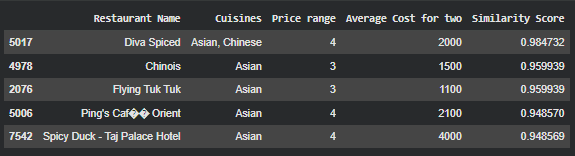

# 📘 Task 2 — Restaurant Recommendation System  
## Content-Based Filtering

## 🧾 1. Problem Statement

The goal of this task is to develop a **restaurant recommendation system** based on features such as cuisines, cost, and service availability.

The problem statement outlines the following requirements:

- Preprocess the dataset by handling missing values and encoding categorical features.
- Use similarity or distance-based techniques to recommend restaurants.
- Allow recommendations based on customer preferences.
- Evaluate recommendation quality and discuss limitations or improvements.

---

## 📊 2. Dataset Overview

The dataset contains useful restaurant attributes such as:

- **Restaurant characteristics**: Cuisines, Price Range, Cost  
- **Service availability**: Table booking, Online delivery  
- **Location information**: City, Locality  
- **User ratings**: Aggregate rating  

These fields allow building a preference-based recommendation logic.

---

## 🧹 3. Data Preprocessing

### ✔ Missing Values
- Only the **Cuisines** column had missing values.
- Missing values were filled with `"Unknown"` to avoid data loss.

### ✔ Categorical Standardization
Cuisine string values were cleaned by:
- Splitting multiple cuisines
- Extracting the primary cuisine for simpler matching

### ✔ Feature Selection
Relevant columns retained for recommendation:
- Restaurant Name
- City
- Cuisines
- Average Cost for two
- Price range
- Has Table booking
- Has Online delivery

This ensures recommendations are based on meaningful criteria.

---

## 🧠 4. Recommendation Approach (Methodology)

This task does not require model training since the goal is to suggest restaurants based on preferences.

A **content-based filtering** approach was used, matching restaurants to user preferences based on feature similarity.

The recommendation logic evaluates:
- Cuisine match
- Cost proximity
- Service preferences (delivery / table booking)
- City match

This approach is lightweight, interpretable, and suitable for structured datasets.

---

## ⚙ 5. Implementation Summary (Notebook Alignment)

The notebook follows this pipeline:

- Load dataset and filter required fields
- Clean and standardize cuisine data
- Accept a user preference dictionary containing:
  - Preferred cuisine(s)
  - Price range
  - Average cost
  - Online delivery requirement
  - Table booking requirement
- Filter restaurants matching user preferences
- Rank or return top matches
- Display final recommendations

This directly aligns with content-based recommendation design.

---

## 👤 6. User Preference Example

A sample user person were used to demonstrate the system:

### ✔ User Preference Example
- Cuisine: Chinese / Asian  
- Budget: Price Range → 3  
- Table Booking: Yes  

This example show recommendation variation across different user profiles.

---

## 📈 7. Evaluation & Discussion

Since this is not a supervised ML task, evaluation is qualitative:

- **Relevance**: Do recommendations match user criteria?
- **Diversity**: Are multiple suitable options provided?
- **Interpretability**: Is it clear why restaurants were recommended?

---

## 🔍 8. Insights & Limitations

### Insights
- Cuisine filtering strongly impacts recommendation quality.
- Price range helps match user lifestyle segments.
- Service flags (delivery / table booking) increase personalization.

### Limitations
- No semantic cuisine similarity (e.g., embeddings)
- No popularity weighting (ratings or votes)
- No learning from user behavior (no ML model)

---

## 🚀 9. Possible Improvements

Future enhancements could include:
- Rating-weighted ranking
- Votes-based confidence scoring
- TF-IDF cuisine embeddings
- Cosine similarity between restaurants
- Collaborative filtering for user behavior

These would transform the system into a more intelligent recommender.

---

## 📝 10. Conclusion

Task-2 successfully demonstrates a **content-based restaurant recommendation system** without machine learning.

Users receive interpretable and customizable recommendations based on explicit preferences, fulfilling the task objective.

---

## 📁 11. Files Included for Task-2

- notebook.ipynb
- README.md
- screenshots/recommendation_user_1.png
- screenshots/recommendation_user_2.png

