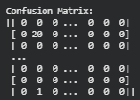
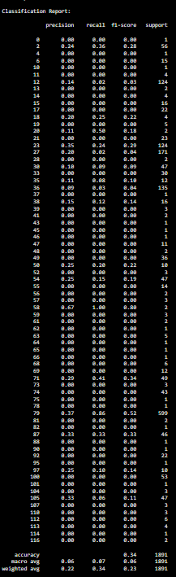

# 📘 Task 3 — Cuisine Classification  
## Multi-Class Machine Learning

## 🧾 1. Problem Statement

The objective of this task is to build a machine learning classification model that predicts the primary cuisine of a restaurant based on its attributes.

The task requires:
- Preprocessing the dataset and handling missing values
- Encoding cuisine as the target variable
- Training a supervised multi-class classification model
- Evaluating model performance using classification metrics
- Analyzing performance across cuisines and identifying challenges or biases

---

## 📊 2. Dataset Overview

The dataset includes the following attributes:

- Cuisines  
- Average Cost for Two  
- Price Range  
- Online Delivery Availability  
- Table Booking Availability  
- Country and City identifiers  
- Ratings and Votes  

The cuisine column often contains multiple cuisines, so a primary cuisine label is extracted for modeling.

---

## 🧹 3. Data Preprocessing

### ✔ Handling Missing Values
- Only the Cuisines column contained missing values
- Missing values were filled with `"Unknown"` to preserve data integrity

### ✔ Primary Cuisine Extraction
- The Cuisines field contains comma-separated values
- The first listed cuisine was extracted as the primary cuisine label  
  Example:  
  North Indian, Chinese → North Indian

### ✔ Dropping Irrelevant Columns
The following non-predictive fields were removed:
- Restaurant Name  
- Ratings  
- Votes  
- Longitude and Latitude  

This reduced noise and model complexity.

---

## 🧮 4. Target Encoding & Class Handling

### ✔ Label Encoding
- The primary cuisine labels were converted into numeric form for training

### ✔ Rare Class Filtering
- The dataset originally contained over 116 cuisine categories
- Many cuisines appeared only 1–2 times
- Rare cuisines below a frequency threshold were removed to:
  - Enable stratified splitting
  - Improve metric reliability
  - Reduce noise from underrepresented classes

This is standard practice in multi-class classification problems.

---

## 🔀 5. Train-Test Split

The dataset was split using stratified sampling:
- Training Set: 80%
- Testing Set: 20%

This ensured cuisine class proportions were preserved.

---

## 🧠 6. Model Selection & Training

A Random Forest Classifier was selected because it:
- Supports multi-class classification natively
- Is robust to noisy data
- Handles categorical encodings well
- Requires minimal feature scaling

The model was trained on processed features to predict cuisine labels.

---

## 📈 7. Model Evaluation

Evaluation metrics included:

### ✔ Accuracy
- Measures overall prediction correctness

### ✔ Classification Report
Provides:
- Precision
- Recall
- F1-Score  
for each cuisine class

Because this is a multi-class imbalanced problem, F1-score is more informative than accuracy.

### Results (from Notebook):
- Accuracy: ~0.33 (≈33%)
- Minority cuisines show weak performance due to imbalance

This performance is expected due to:
- Large number of cuisine classes
- Sparse class distribution
- Limited predictive power of available features

---

## 📊 8. Evaluation Visualizations

### Confusion Matrix
Visualizes cuisine-level misclassifications.

### Classification Metrics Table

These visualizations highlight confusion between similar cuisines.

---

## 🔍 9. Insights, Biases & Challenges

### High Number of Classes
- Over 100 cuisine categories make prediction inherently difficult

### Severe Class Imbalance
- Some cuisines have hundreds of samples, others fewer than five
- Results in poor recall for minority classes

### Limited Predictive Features
- Price, cost, and service availability are weak indicators of cuisine type

### Feature Overlap
- Many cuisines share similar pricing and service patterns

---

## 🧠 10. Interpretation & Takeaways

- Popular cuisines were predicted significantly better
- Rare cuisines were frequently misclassified
- Asian, Continental, and mixed cuisines overlapped heavily
- The task highlights the importance of rich, domain-specific features

---

## 🚀 11. Possible Improvements

Future improvements could include:
- TF-IDF on cuisine descriptions
- Dish-level NLP embeddings
- SMOTE or class-weighted training
- Boosting models (XGBoost, LightGBM)
- Hierarchical cuisine classification
- Top-K accuracy evaluation

---

## 📝 12. Conclusion

Task 3 demonstrates a complete multi-class classification pipeline:
- Encoding
- Stratified splitting
- Model training
- Metric evaluation
- Bias and limitation analysis

Although the model achieved ~33% accuracy, the results are realistic given the dataset complexity and meet the learning objectives.

---

## 📁 13. Files Included

- notebook.ipynb    
- README.md  
- screenshots/confusion_matrix.png  
- screenshots/classification_report.png  
