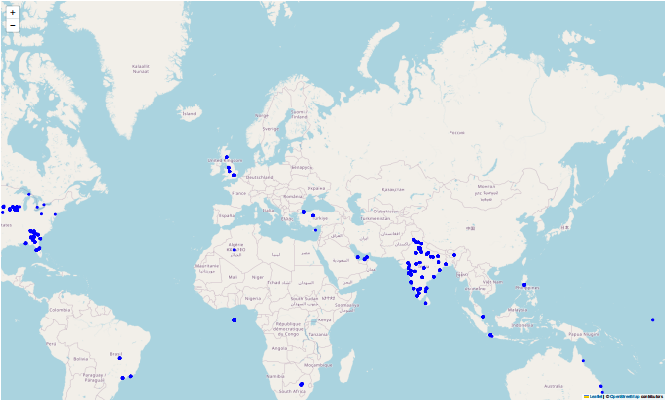
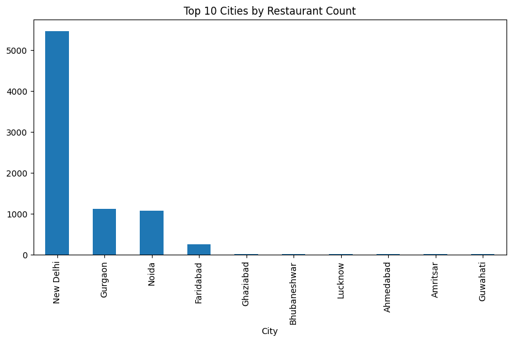
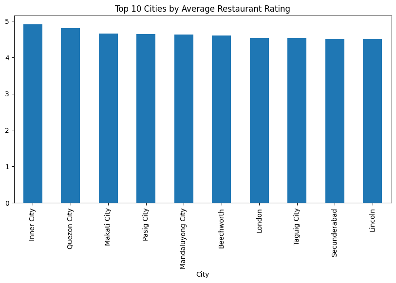
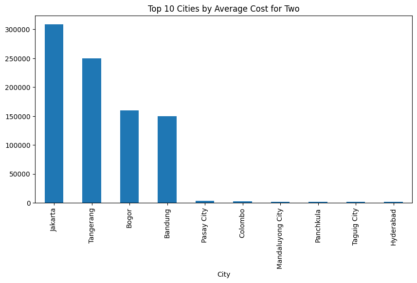
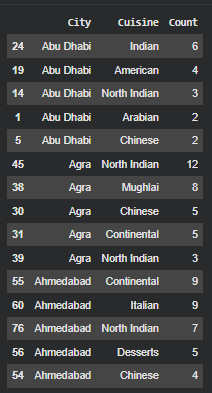

# 📘 Task 4 — Location-Based Restaurant Analysis (Geospatial EDA)

## 🧾 1. Problem Statement

The objective of this task is to perform a location-based analysis of restaurants using their geographical and contextual attributes.

The problem statement specifies the following subtasks:

- Explore the latitude and longitude coordinates and visualize restaurant distribution on a map.
- Group restaurants by city or locality and analyze their concentration.
- Calculate location-specific statistics such as average ratings, popular cuisines, and average price range.
- Identify interesting insights or patterns based on geographical information.

## 📊 2. Dataset Overview

The dataset includes relevant spatial and contextual fields such as:

- Location: City, Locality, Latitude, Longitude
- Quality Metrics: Aggregate Rating
- Cuisine Information: Cuisines
- Cost Metrics: Average Cost for Two, Price Range

These attributes support geospatial visualization, regional aggregation, and statistical comparison across areas.

## 🧹 3. Data Preprocessing

To align with geospatial analysis objectives, only relevant columns were retained:

- Restaurant ID
- Restaurant Name
- City
- Locality
- Locality Verbose
- Latitude
- Longitude
- Cuisines
- Aggregate rating
- Price range
- Average Cost for two

### ✔ Missing Value Handling

Only the Cuisines column contained missing values in the filtered dataset.  
Missing entries were filled with "Unknown" to preserve full spatial coverage.

### ✔ Geospatial Integrity

Rows with missing latitude/longitude values were excluded to ensure valid mapping.

This preprocessing resulted in a clean, complete dataset ready for spatial analysis.

## 🌍 4. Geographic Visualization (Notebook Step-1)

An interactive Folium map was generated to visualize restaurant distribution based on latitude and longitude coordinates.

### ✔ Key Characteristics:

- Centered using mean coordinate values
- Blue circular markers for each restaurant
- Zoom and pan enabled

### 📌 Outcome

The map revealed dense restaurant clusters in urban areas and sparse distributions in peripheral regions.

## 🏙️ 5. Restaurant Concentration by Area (Notebook Step-2)

Restaurants were grouped by City to determine the most restaurant-dense areas.

### ✔ Grouping Logic:
`city_counts = df_geo["City"].value_counts()`

### ✔ Visualization:

A bar plot for the Top 10 cities was generated.

### 📌 Outcome

Cities with the highest restaurant counts likely represent:

- Major commercial hubs
- Dense population centers
- Strong tourism influence

## 📈 6. Location-Specific Statistics (Notebook Step-3)

To identify geographical differences, metrics were computed at the city level, including:

### A. Average Rating per City

Helps identify cities with better-rated dining experiences.
 

### B. Average Cost for Two per City

Shows spending expectations and affordability variations.

### C. Top Cuisines per City

Cuisine strings were split and exploded to compute top cuisines for each city.
 

These metrics revealed clear variation in:

- Consumer preferences
- Purchasing power
- Restaurant pricing strategies

across different cities.

## 🧠 7. Insights & Pattern Discovery (Notebook Step-4)

This step interprets the geospatial and statistical findings.

### 🌍 Insight 1 — Spatial Clustering

Restaurants form geographical clusters in major city centers, indicating:

- ✔ High foot traffic
- ✔ Developed commercial zones
- ✔ Food-centric neighborhoods

### 🏙️ Insight 2 — City-Level Density Variation

Cities with high restaurant density suggest:

- ✔ Larger populations
- ✔ Active food culture
- ✔ Higher economic activity
- ✔ Tourism influence

Cities with lower density indicate narrower market demand.

### ⭐ Insight 3 — Quality Differences Across Cities

Cities with higher average ratings point to:

- ✔ Higher consumer expectations
- ✔ Better service quality
- ✔ Premium dining culture

While dense cities sometimes showed lower ratings due to:

- ✔ Higher competition
- ✔ Budget-friendly dining focus

### 💰 Insight 4 — Cost Variation Across Cities

Differences in average cost reflect:

- ✔ Purchasing power
- ✔ Tourism pricing
- ✔ Operational cost differences
- ✔ Socioeconomic segmentation

### 🍽️ Insight 5 — Cuisines Reflect Cultural Geography

Cuisine popularity patterns showed:

- ✔ Regional food cultures
- ✔ Cosmopolitan diversity in metros
- ✔ Local gastronomy influences

### 🧩 Insight 6 — Combined Market Interpretation

Cities can be categorized as:

| Market Type | Characteristics |
|---|---|
| Premium Markets | High cost + high ratings + moderate density |
| Competitive Markets | High density + moderate/low ratings |
| Underserved Quality Markets | Low density + high ratings |
| Budget Markets | High density + low cost |

This classification is valuable for restaurant business decisions.

## 📝 8. Conclusion

This task demonstrated how geospatial analytics can reveal meaningful restaurant market patterns without machine learning.

The task successfully fulfilled objectives by:

- ✔ Mapping restaurant distribution
- ✔ Identifying density patterns
- ✔ Computing city-level metrics
- ✔ Extracting actionable business insights

This highlights the importance of location intelligence in restaurant and retail industries.

## 📁 9. Files Included for Task-4

- notebook.ipynb
- README.md (this file)
- screenshots/folium_map.png
- screenshots/city_restaurant_count.png
- screenshots/avg_rating_by_city.png
- screenshots/avg_cost_by_city.png
- screenshots/top_cuisines_by_city.png

**Note:** Due to interactive Folium map outputs, GitHub cannot render the map preview inside the notebook; please refer to the exported PDF and screenshots for proper visualization of the results.
